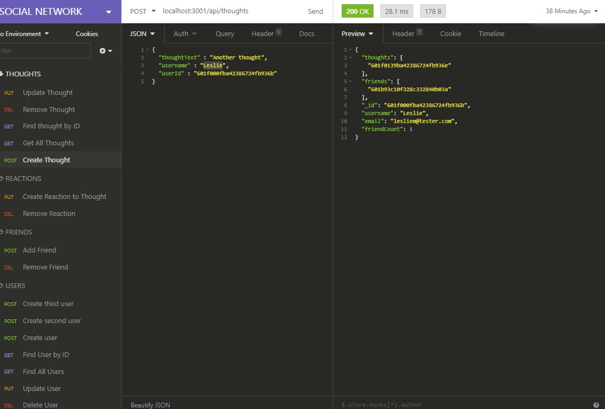

# Social Network

   

  ## Table of Contents
  1. [Description](#description)
  2. [Installation Instructions](#installation-instructions)
  3. [Usage Information](#usage-information)
  4. [Tests](#tests)
  5. [Questions](#questions)

  ## Description

API for a social network web application where users can share their thoughts, react to friends' thoughts, and create a friends list.

Using Express.js and Mongoose ODM, create models in MongoDB and routes for the RESTful API end-points.  Use the Moment.js npm package to format time. 

  [Github Pages](https://github.com/webprinc3ss/social-network)

  [Link to Demo](https://drive.google.com/file/d/150fot3lkTtuUIntXz6A6Bh_7sP0vW6gg/view)

  ## Installation Instructions

[Clone the repo](git@github.com:webprinc3ss/social-network.git)

[Install node.js](https://nodejs.org/en/)

Type npm i in to your terminal.
   
  ## Usage Information
Type npm i to install the dependencies, then npm start to start the server. Test routes using using Insomnia.

  ## Tests
  Use Insomnia Core to test the following endpoints
  [Download Insomnia Core](https://insomnia.rest/download/core/)

    Users
        GET:        localhost:3001/api/users/
        GET by ID:  localhost:3001/api/users/:id
        CREATE:     localhost:3001/api/users
        UPDATE:     localhost:3001/api/users/:id
        DELETE:     localhost:3001/api/users/:id

    Thoughts
        GET:        localhost:3001/api/thoughts
        GET by ID:  localhost:3001/api/thoughts/:id
        CREATE:     localhost:3001/api/thoughts
        UPDATE:     hlocalhost:3001/api/thoughts/:id
        DELETE:     localhost:3001/api/thoughts/:id

    Reactions
        CREATE:     localhost:3001/api/thoughts/:id/reactions
        DELETE:     localhost:3001/api/thoughts/:id/reactions/:id

    Friends
        CREATE:     localhost:3001/api/thoughts/:id/friends/:id
        DELETE:     localhost:3001/api/thoughts/:id/friends/:id

  ## Questions
  Please feel free to contact me, webprinc3ss at Github: https://github.com/webprinc3ss 

  or

  djabranton@gmail.com. 